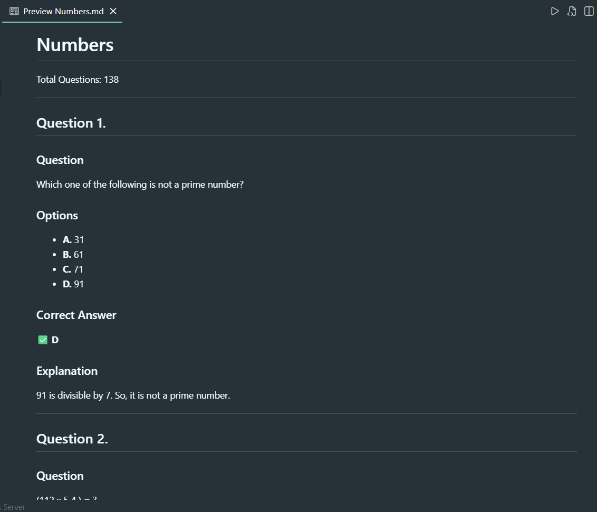
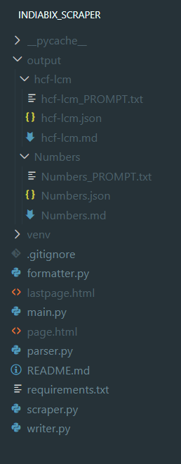
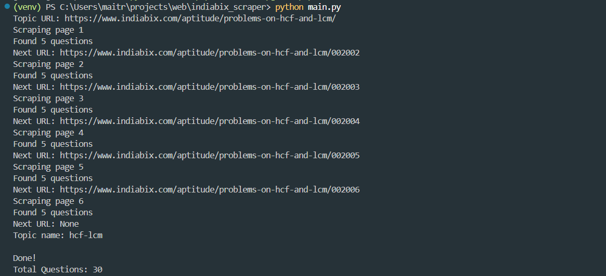

# IndiaBix Aptitude Scraper

A Python-based web scraper that extracts aptitude questions from IndiaBix and converts them into clean study notes.

The project is designed to help with placement preparation by creating structured Markdown notes containing:
- Questions
- Multiple-choice options
- Correct answers
- Clean explanations
- Video explanations (when available)
- AI study prompts for learning theory and shortcuts before solving problems

---

## Features

✅ Scrapes aptitude questions from IndiaBix  
✅ Handles multiple pages automatically  
✅ Extracts:
- Question statements
- Options
- Correct answers
- Explanations
- Video links

✅ Cleans messy HTML formatting  
✅ Generates topic-wise output folders  
✅ Creates:
- Markdown notes
- JSON data
- AI learning prompts

---
```markdown
## Project Structure

indiabix_scraper/

├── main.py              # Main execution pipeline
├── scraper.py           # Handles webpage fetching
├── parser.py            # Extracts questions and answers
├── formatter.py         # Cleans extracted HTML text
├── writer.py            # Generates Markdown, JSON and prompts

├── output/
│   └── Percentage/
│       ├── Percentage.md
│       ├── Percentage.json
│       └── Percentage_PROMPT.txt

├── requirements.txt
├── README.md
└── .gitignore
````

---
## Screenshots

### Generated Markdown Notes



### Project Structure



### Scraper Execution



---
## Installation

Clone the repository:

```bash
git clone <repository-url>
cd indiabix_scraper
````

Create a virtual environment:

```bash
python -m venv venv
```

Activate virtual environment:

### Windows

```bash
venv\Scripts\activate
```

### Linux / WSL

```bash
source venv/bin/activate
```

Install dependencies:

```bash
pip install -r requirements.txt
```

---

## Usage

Run:

```bash
python main.py
```

Enter the IndiaBix topic URL:

Example:

```
https://www.indiabix.com/aptitude/percentage/
```

Enter topic name:

```
Percentage
```

The scraper will automatically:

1. Fetch all available pages
2. Extract questions
3. Process explanations
4. Generate study material

---

## Example Output

```
output/

└── Percentage/

    ├── Percentage.md
    ├── Percentage.json
    └── Percentage_PROMPT.txt
```

### Markdown Output

The generated Markdown contains:

```markdown
## Question 1

A batsman scored 110 runs...

### Options

A. 45%
B. 5/11
C. 6/11
D. 55%

### Correct Answer

B

### Explanation

Number of runs made by running...
```

---

## AI Study Prompt Generation

The generated prompt file can be used with AI tools to learn:

* Important concepts before solving questions
* Shortcuts and tricks
* Common placement patterns
* Alternative solving methods
* Practice strategies

Example:

```
Before solving these Percentage questions:

1. Explain all concepts required.
2. Teach important shortcuts.
3. Explain common mistakes.
4. Then solve questions step-by-step.
```

---

## Technologies Used

* Python
* BeautifulSoup4
* Requests
* lxml
* Markdown generation

---

## Learning Goals

This project was built to practice:

* Web scraping
* HTML parsing
* Data extraction
* File generation
* Automation
* Building useful developer tools

---

## Future Improvements

Possible enhancements:

* Add more websites
* Add difficulty classification
* Generate flashcards automatically
* Create a web interface
* Add AI-powered explanations automatically

---

## Author - Maitri Jain